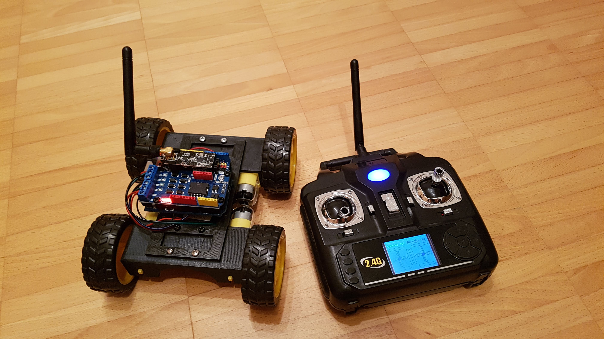
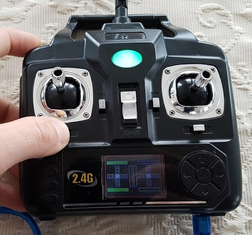
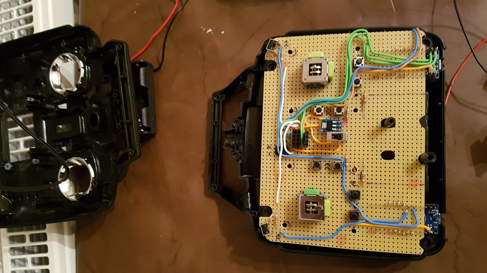
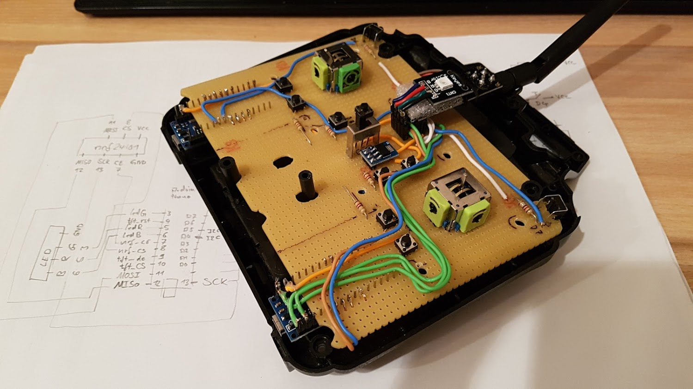
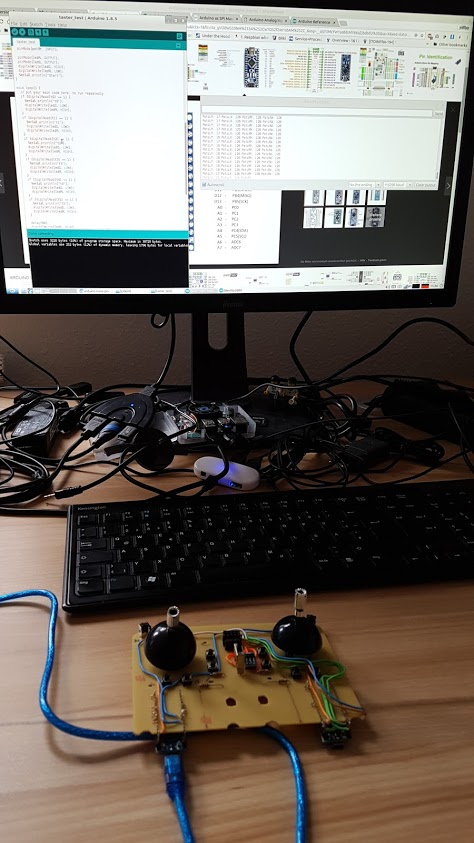
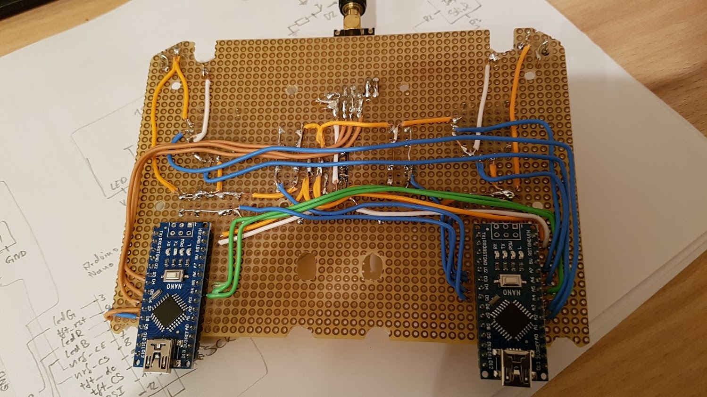
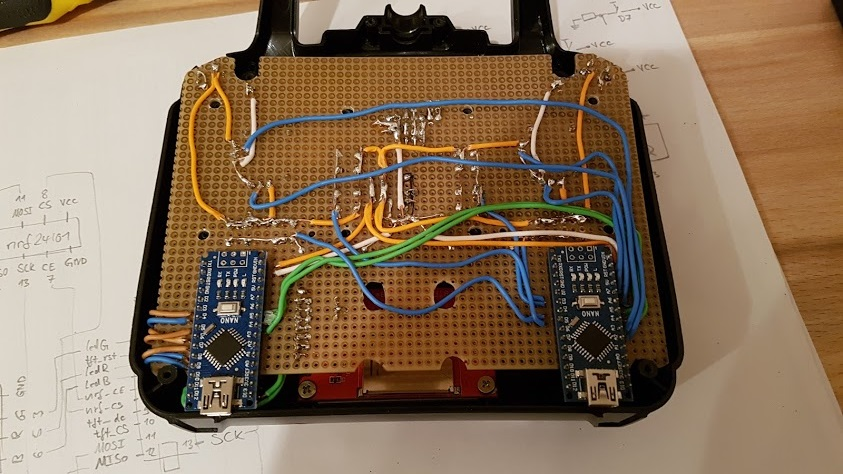
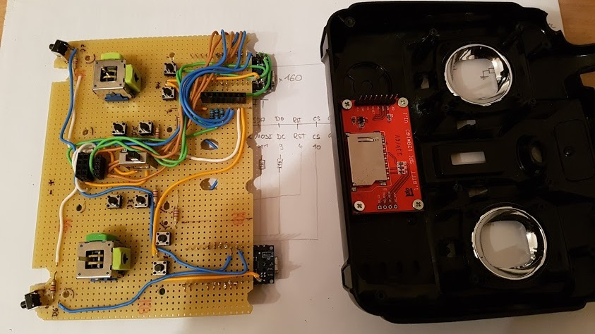
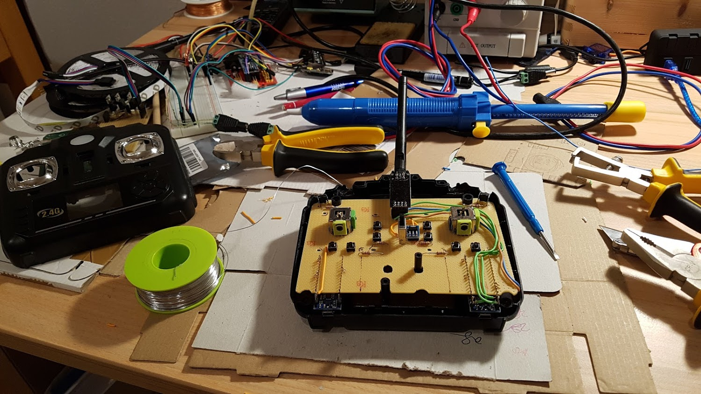
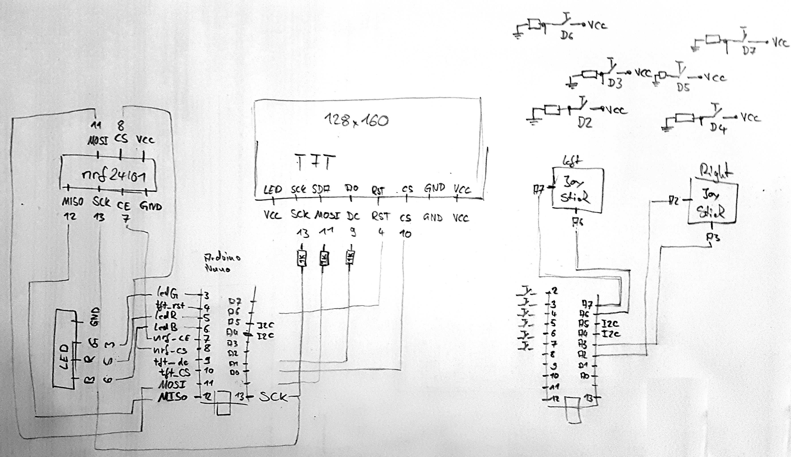

# Arduino RC Transmitter

This project started because I was not completely able to decrypt the protocol of a simple RC transmitter which I already owned. I decided to build the electronics by my own, replaced the existing board, and reused the body and its buttons also because I wanted it to be more feature rich.

# Setup
The board has two controllers (Arduino Nano). The right one is listening for input signals (buttons and joysticks) and sends them periodically to the left one which controls the TFT-display and the 2.4GHz antenna.

## Functionality & Features
* The transmitter can be switched **on or off** by using the button in the center.
* There are **6 push buttons** and by using them they appear green on the **tft display**.
* There are **2 joysticks** and there using is also visualized on the tft display.
* There is **RGB LED** below the **2.4G antenna** which shows if the transmitter is switched on and changes the color if it is connected.
* After switching the transmitter on you have to calibrate the joysticks because their behavior depends on battery level.
* The 2 button in the center are for choosing a profile out of the range from A to Z. It is up to the receive how to react on it.
* If you press the 4 outer buttons at the same time you will land up in a **menu**. The menu contains **profiles** of different devices to connect to and it allows you to switch between them.  
* If the transmitter is connected to another device it will send it's status frequently. 
```c++
class NrfMessage : public ButtonValues {
public:
  char mode = '0';

  void print();
};

class ButtonValues {
public:
  bool initialized = false;

  bool btn_bottom_right = false;
  bool btn_bottom_left = false;
  bool btn_middle_right = false;
  bool btn_middle_left = false;
  bool btn_top_right = false;
  bool btn_top_left = false;

  unsigned char poti_right_X = 127;
  unsigned char poti_right_Y = 127;
  unsigned char poti_left_X = 127;
  unsigned char poti_left_Y = 127;

  void print();
};
```

# Subprojects
<table>
  <tr><td>
    Project Link: <a href="projects/Adeept_Smart_Car_Kit/Adeept_RC_Car">Software for Adeept RC Car - Original_Adeept_Smart_Car</a> <br />
    Product Link: <a href="http://www.adeept.com/adeept-remote-control-smart-car-kit-for-arduino-based-on-nrf24l01-24g-wireless-robot-starter-kit-with-pdf-guidebook-tutorial_p0025_s0020.html">Adeept Remote Control Smart Car Kit for Arduino based on NRF24L01 2.4G Wireless, Robot Starter Kit with PDF Guidebook/Tutorial</a>
  </td>
  <td></td>
</tr>
  
<tr><td>
Project Link: <a href="projects/4WD_RC_Car_AddeptDriverBoard">Software for 4WD Car - based on Arduino Uno and Adeept Smart Car Motor Driver</a>
  </td>
  <td></td>
</td></tr>
  
</table>

# Build and upload subprojects to a micro controller
This repo is based on [platformio](http://docs.platformio.org) and all subprojects can be build by executing the following command in the root folder:

```bash
pio run   # Builds all
```

You can also specify one specific subproject by using an environment in order to build and upload it to a device. The environments can be found in the [platformio.ini](platformio.ini) file.

If you want to upload a subproject to a micro controller just define the subproject by an environment and choose the target upload. In the following example I choose Transmitter_ButtonsController as environment. 
```bash
pio run -e Transmitter_ButtonsController -t upload  # Uploads only the subproject Transmitter_ButtonsController
```

All definitions about which environments exist and which boards I used is defined in [platformio.ini](platformio.ini) file.

You can check whether your uploads worked by having a look on the device monitor. Therefore just let the usb cable plugged in the board and execute the following command. I used for all boards the baud rate of 115200. The port will usually be chosen automatically.

```bash
cd arduino-rc-transmitter     # Go into the repo root directory
pio device monitor -b 115200  # Start serial monitor to see logs from board
```


## Build Repo in Docker Image
I've provided a [dockerfile](docker/Dockerfile) which creates a docker image. This docker image contains everything to run platformio in order to build the repo. It consists mainly of ubuntu, python2, platformio, and this repo. The only prerequisite is to have [docker](https://www.docker.com/get-started) or [docker toolbox](https://docs.docker.com/v17.12/toolbox/) installed. By executing the following command the docker image will be created containing the latest repo version which will be also build during the image creation.

```bash
cd arduino-rc-transmitter                       # go into the repo root directory
docker build -t arduino-rc-transmitter docker   # builds the docker image
```

You can use the docker image as build and/or development environment. Just start the image by using the following command:

```bash
docker run -it arduino-rc-transmitter   # Start docker container
```

Now you can reuse the command from above to build the projects and upload the binary code to micro controllers. You can find therefore the repo downloaded and prepared in */home/arduino-rc-transmitter*.

# Pictures
<table><tr>
  <td></td>
  <td></td>
  <td></td>
  <td></td>
</tr><tr>
  <td></td>
  <td></td>
  <td></td>
  <td></td>
</tr><tr>
  <td></td>
</tr></table>
