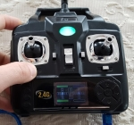
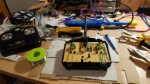
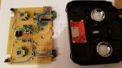
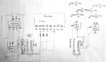
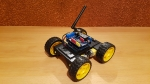
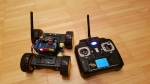
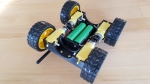
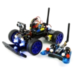
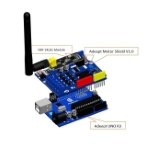

# Radio Controlled Arduino Devices

This repo is a collection of projects which are about remote controlled devices and its remote controls. All projects are based on arduino boards and radio control (2.4GHz). The transmitter and remote controlled devices are all compatible. The software for the Atmega Controller / Arduino Boards are written in c++ and based on the [platformio](https://platformio.org) framework.

Find a list about the projects below.


# Projects
You can find the descriptions of the single projects within the subfolders of the [project folder](/projects). 

<table>

<tr><td>
<center>
<a href="/projects/RC_Transmitter"><b>Remote Controller - Transmitter</b>
</ br>
 </a> </center>
</td> <td>
This remote control can control remote device via radio 2.4Ghz. It can connect the the device from the other projects. There is also a menu which allows the user to switch between the remote devices. 
</td> </tr>

<tr><td>
<center>
<a href="/lib/RC_Library"><b>Remote Controller Library</b>
</a> </center>
</td> <td>
This library contains the classes which are shared between remote controller and remote devices. 
(It's actually not a single project but a dependency for almost every project within this repository.)
</td> </tr>

<tr><td>
<center>
<a href="/projects/Original_Adeept_Car_Kit_from2016/"><b>Original Adeept Smart Car from 2016</b>
</ br>
 </a> </center>
</td> <td>
This "Remote Control Smart Car Kit" can be purchased from <a href="http://www.adeept.com">Adeept</a>. It is also based on arduino boards and the NRF24L01 wireless board. This source code comes originally from Adeept and is intended for the Arduino sitting on the smart car. (This code is untouched and is documented here as a reference implementation and backup)
</td> </tr>

<tr><td>
<center>
<a href="/projects/Original_Adeept_Car_Kit_from2016/"><b>Original Adeept Remote Controller from 2016</b>
</ br>
 </a> </center>
</td> <td>
The Remote Control from <a href="http://www.adeept.com">Adeept</a> was contained within the smart car kit package but can also be purchased as single component. Also this code comes originally from Adeept and is documented here as reference implementation and backup.
</td> </tr>

<tr><td>
<center>
<a href="/projects/Adeept_Smart_Car_Kit/"><b>Adeept Smart Car from 2016 reimplementation</b>
</ br>
 </a> </center>
</td> <td>
This is a complete reimplementation of the original "Adeept Smart Car Project". It works in conjunction with both remote controls and doesn't contain the autonomous driving part yet.
</td> </tr>

<tr><td>
<center>
<a href="/projects/Adeept_Smart_Car_Kit/"><b>Adeept Remote Controller from 2016 adjustment</b>
</ br>
 </a> </center>
</td> <td>
In this project I also took the Remote Control from <a href="http://www.adeept.com">Adeept</a> and based on the originally code I made it compatible with the implementation for my remote devices. Therefore I used the <a herf="/lib/RC_Library">remote controller library</a> from above. 
</td> </tr>

<tr><td>
<center>
<a href="/projects/4WD_RC_Car_AddeptDriverBoard/"><b>4WD Car based on Adeept Board</b>
</ br>
 </a> </center>
</td> <td>
In this project I built a 4WD Car based on an Arduino Uno Board, the Motor Driver Board from <a href="http://www.adeept.com">Adeept</a> and self-3d-printed car platform. The car is compatible to both remote controllers.
</td> </tr>

</table>

# Build and Upload Projects to an Arduino
This repository is based on [platformio](http://docs.platformio.org) and all projects in this repository can be build by executing the following command. 
As prerequisite for building this repository you need to install [platformio](https://platformio.org/platformio-ide). I personally install [VSCode](https://code.visualstudio.com) and within VSCode I installed the [platformio-ide extension](https://marketplace.visualstudio.com/items?itemName=platformio.platformio-ide). 
This example:
1. downloads the whole repository from git,
2. goes into the repository root folder,
3. and executes the build command from platformio. It will initially download all dependencies and packages and then it will build all projects mentioned above. At the end of the whole procedure you will get a summary and state of what was built and if it were successfully. 
```bash
git clone https://github.com/grimmpp/radio-controlled-arduino-devices.git   # download the repository from git
cd radio-controlled-arduino-devices                                         # go into the repository root directory
pio run                                                                     # download all dependencies initially and builds all projects
```
 
The projects in here are actually define as different environment in the [platformio.ini](/platformio.ini) file. Have a look into the file for more details. 
You can also specify one specific project by using an environment in order to build only one and upload it to a device.

If you want to upload a project to a micro controller just choose the project by passing an environment name and the target upload. In the following example I choose *Transmitter_ButtonsController* as environment. This example will build the project and upload the binaries in an Arduino Nano is connected to an USB Port.
<b> 
```bash
pio run -e Transmitter_ButtonsController -t upload  # Uploads only the subproject Transmitter_ButtonsController
```
</b>
All definitions about which environments exist and which boards I used is defined in [platformio.ini](platformio.ini) file.

## Monitor Serial Port (logs) from connected Arduino

You can check whether your uploads worked by having a look on the device monitor. Therefore just let the usb cable plugged in the board and execute the following command. I used for all boards the baud rate of 115200. The port will usually be chosen automatically.
<b>
```bash
cd arduino-rc-transmitter     # Go into the repo root directory
pio device monitor -b 115200  # Start serial monitor to see logs from board
```
</b>

## Build this Repository in a Docker Container
I've provided a [dockerfile](docker/Dockerfile) which creates a docker image. This docker image contains everything to run platformio in order to build this whole repository. During the docker image build process the repository will be downloaded and built. The image consists mainly of ubuntu, python2, platformio, and contains this repository. The only prerequisite is to have [docker](https://www.docker.com/get-started) or [docker toolbox](https://docs.docker.com/v17.12/toolbox/) installed. I recommend not to use docker for windows because the feature for mapping usb ports is not yet implemented. 
By executing the following command the docker image will be created:
<b>
```bash
cd radio-controlled-arduino-devices/docker             # go into the repository's docker directory
docker build -t arduino-rc-devices-docker .     # builds the docker image
```
</b>

You can use the docker image as build and/or development environment for this repository. Just start the image by using the following command:
<b>
```bash
docker run -it arduino-rc-devices-docker   # Start docker container
```
</b>
Now you can reuse the command from above to build the projects and upload the binary code to micro controllers. You can find therefore the repository downloaded and prepared in <b>/home/arduino-rc-transmitter</b>.

# Pictures
<table><tr>
  <td></td>
  <td></td>
  <td></td>
  <td></td>
  <td></td>
</tr><tr>
  <td></td>
  <td></td>
  <td></td>
  <td></td>
  <td></td>
</tr></table>
