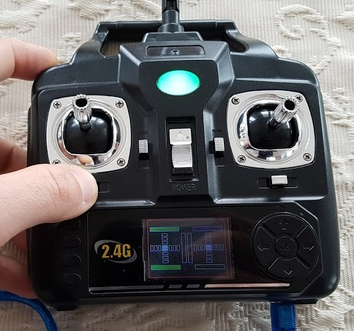
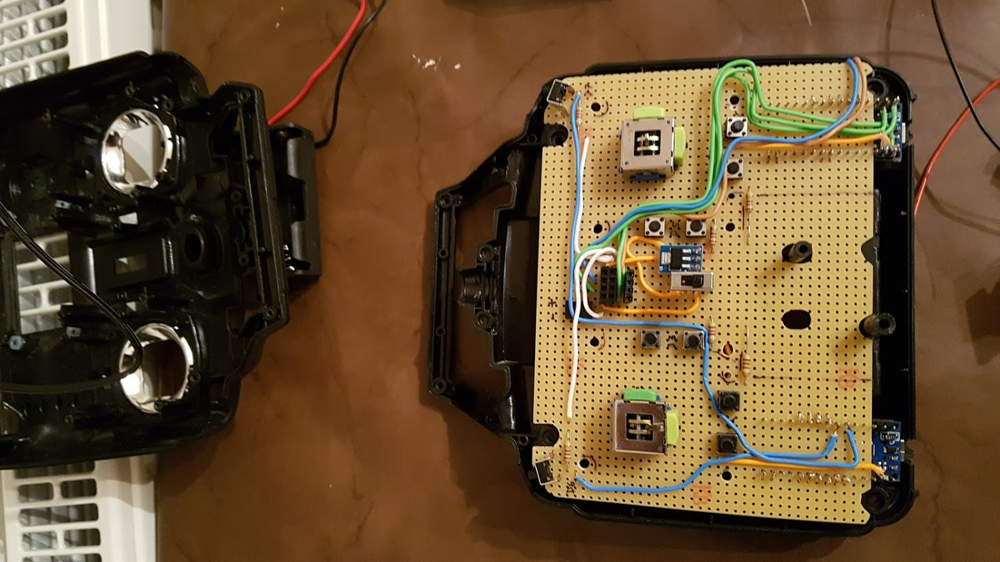
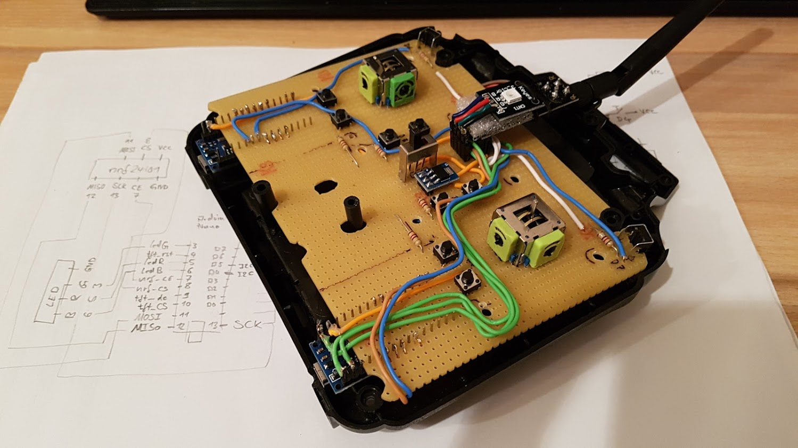
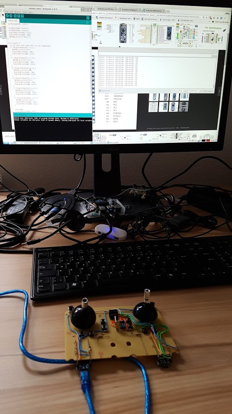
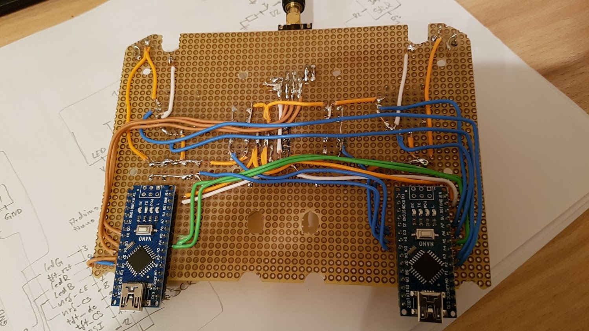
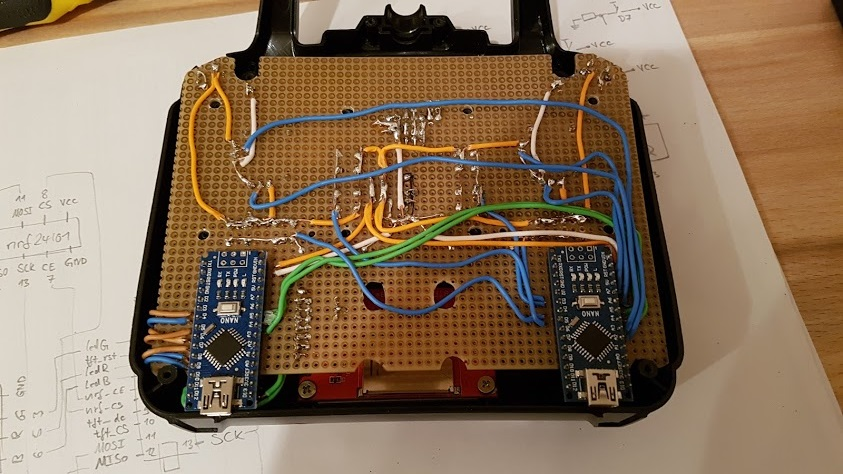
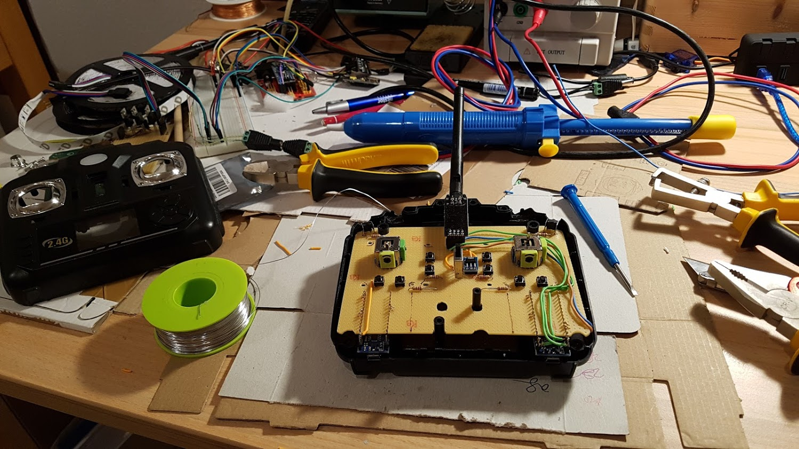
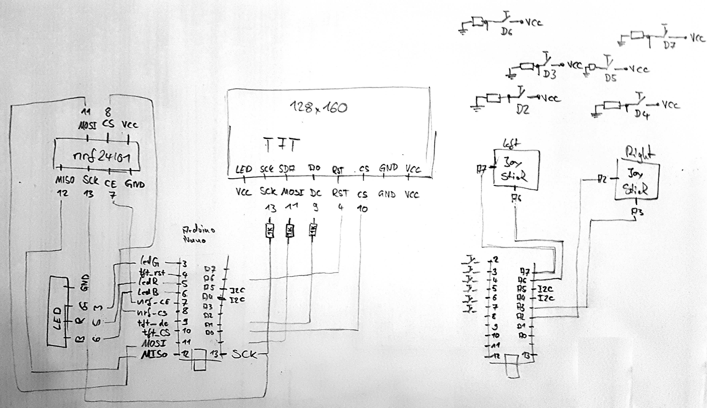

# Arduino RC Transmitter

This project started because I was not completely able to decrypt the protocol of a simple RC transmitter which I already owned. I decided to build the electronics by my own, replaced the existing board, and reused the body and its buttons also because I wanted it to be more feature rich.

# Setup
The board has two controllers (Arduino Nano). The right one is listening for input signals (buttons and joysticks) and sends them periodically to the left one which controls the TFT-display and the 2.4GHz antenna.

## Functionality & Features
* The transmitter can be switched **on or off** by using the button in the center.
* There are **6 push buttons** and by using them they appear green on the **tft display**.
* There are **2 joysticks** and there using is also visualized on the tft display.
* There is **RGB LED** below the **2.4G antenna** which shows if the transmitter is switched on and changes the color if it is connected.
* After switching the transmitter on you have to calibrate the joysticks because their behavior depends on battery level.
* If you press the 4 outter buttons at the same tinme you will land up in a **menu**. The menu contains **profiles** of different devices to connect to and it allows you to switch between them.  
* If the transmitter is connected to another device it will send it's status frequently. 
```c++
class ButtonValues {
public:
  bool initialized = false;

  bool btn_bottom_right = false;
  bool btn_bottom_left = false;
  bool btn_middle_right = false;
  bool btn_middle_left = false;
  bool btn_top_right = false;
  bool btn_top_left = false;

  unsigned char poti_right_X = 127;
  unsigned char poti_right_Y = 127;
  unsigned char poti_left_X = 127;
  unsigned char poti_left_Y = 127;

  void print();
};
```

# Pictures
<table><tr>
  <td></td>
  <td></td>
  <td></td>
  <td></td>
</tr><tr>
  <td></td>
  <td></td>
  <td></td>
  <td></td>
  <td></td>
</tr></table>
